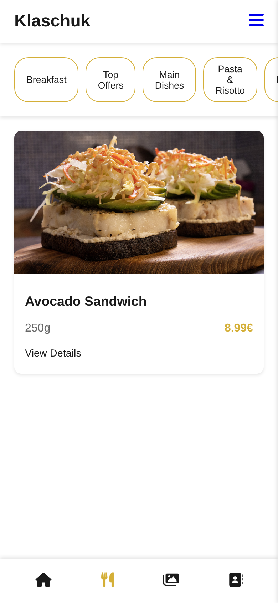
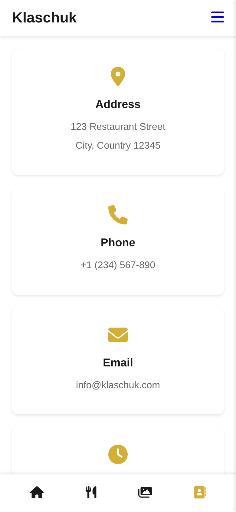
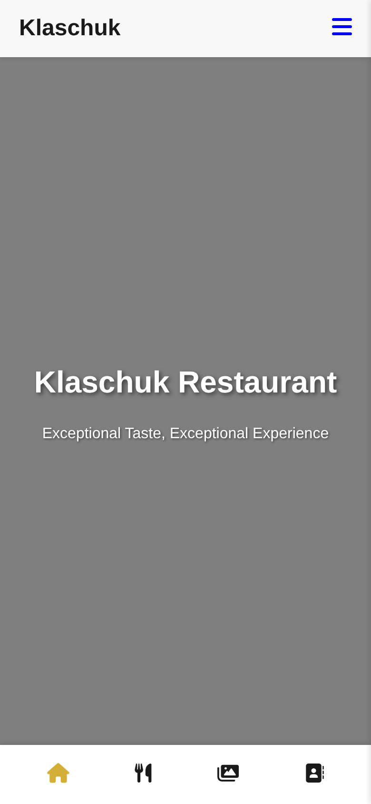

# Restaurant Menu

**A mobile-first restaurant website template** — menu with category filters, dish details, photo gallery and contacts. Plain HTML, CSS and JavaScript, no build step.

<table>
  <tr>
    <td width="33%"></td>
    <td width="33%"></td>
    <td width="33%"></td>
  </tr>
</table>

## What is inside

- **Menu** rendered from a JSON file, with category chips (Breakfast, Pasta & Risotto, Pizza, Desserts, Cocktails, Wine list and more)
- **Dish details** page with weight, price and description
- **Gallery** with Interior / Dishes / Events filters
- **Contacts** page and a bottom tab bar for one-thumb navigation on phones
- Sample data only: one demo dish and placeholder contact details, ready to be replaced

## Run it

```bash
cd restaurant-menu
python3 -m http.server 8000     # http://localhost:8000
```

A local server is needed because the menu is loaded with `fetch` from `json/menu-data.json`.

## Make it your own

Add dishes to `restaurant-menu/json/menu-data.json`:

```json
{
  "name": "Avocado Sandwich",
  "weight": "250g",
  "price": "8.99€",
  "image": "images/dishes/avocado-sandwich.jpg",
  "category": "Breakfast",
  "description": "..."
}
```

Then drop the photo into `restaurant-menu/images/dishes/` and edit the contact details in `pages/contacts.html`.

## Structure

```
restaurant-menu/
├── index.html
├── pages/     menu · view-details · gallery · contacts
├── css/       one stylesheet per page plus shared style and animations
├── js/        menu, details, sidebar, contacts
├── json/      menu-data.json
└── images/
```
